> Hunt is based on puzzles like that of Cicada 3301

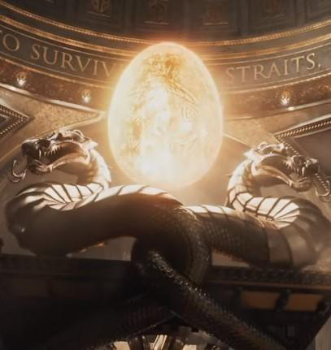{width="2.4305555555555554in"
height="2.5722222222222224in"}

> The image is from the 'Ready Player'\
> franchise, more precisely 'Ready Player One' movie
>
> Day 1 of hunt:
>
> First link: (contained a video and an image)
>
> Image had an encrypted link, which was vigenere cipher\
> with the key 'patience'
>
> On decrypting, The link had the following text:\
> cutt.ly/{Maybe if Herbert Jr. had made his invention singular, it
> would have made an excellent companion to Potassium Aluminum -
> Electron Lepton and add the first 10-digit prime number found in
> consecutive digits of e at the end of the name}\
> Herbert Jr. -\> Kryptos (plural) -\> Krypto (singular)\
> 10-digit prime -\> 7427466391\
> So, the final link: cutt.ly/krypto7427466391
>
> 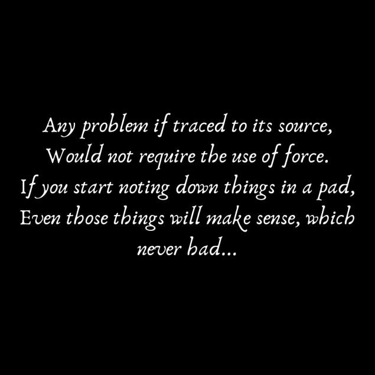{width="2.8847222222222224in"
> height="2.8847222222222224in"}
>
> On opening the above link, a dropbox opens with an image named
> ǝᴉpoɹqpɹɐɥɔᴉɹ.png -\> Richard Brodie -\> Original Developer of Notepad
> and MS word, and also as hinted by the riddle in the image, the image
> had to opened in Notepad.

On opening with notepad, the following came:

\--encrypted text begins\--\
khgpd://zpn.xddspbx.nrf/j/9djwth14tmct9tf/uzdwvrrnonv.tue?gz=0
\--encrypted text ends---

The key is to not make fun of your Tax Guy\'s dance moves;\
although he is not a great guy,\
he still helps lost kids in the city so nice they named it twice

The key for the above link was DONALDTRUMP, which decrypted the link and
led to a dropbox file.

In the drop box, there was a zip file by the name anotherclue.zip, it
had 2 files: Chapters.mp3\
ɔɹǝɐʇǝpqʎᴉsʇɥǝʞǝʎ.txt -\> createdbyisthekey

On opening the notepad file, the following text is present:

\--encrypted text begins\--\
moloc://jji.okdzsth.peh/p/fgk8kjvvo9s700b/idlzmf.qem?ru=0 \--encrypted
text ends\--

The key was thedufferbrothers, which decrypted the link using beaufort
cipher, and led to a .zip file.

The zip had two files:\
float like a cadillac sting like a beemer.mp3 B-).zip (password
protected)

Translation of the mp3 file (after changing speed/reversing the audio)
was: "The fault, dear Brutus, is not in our stars.\" It\'s really not!
It lies somewhere else. I don\'t know why Peter Van Houten disagreed,
maybe The Man of Tomorrow should help him."

Peter Van Houten is from 'The Fault in our Stars', and also written a
quote related to it on the main site 'cyptixhunt.co' which was:

*"oblivion is inevitable, and that we\'re all doomed and that there will
come a day when all our labor has been returned to dust, and I know the
sun will swallow the only earth we\'ll ever have"*

On searching the site, on the hints page under the name of the admin
(TheFallen1), the following text was found:\
"We all have our little faults. Mine\'s in California", which is related
to the book, thus the password for zip was California.

(Also the famous quote from Superman(1978) movie by lex luthor)

> Inside the zip file, there were 3 files:\
> file\
> hint.c\
> itisaclue.txt
>
> hint.c was a C file, which was same as the 'donut.c' file which
> creates an animation of a donut. 'file' was a password protected zip
> file which had Notsoinnovative.txt,\
> and itisaclue.txt contained the following lines:
>
> password = This ain\'t Surrealism, nor is this Impressionism, and this
> is surely not abstract. This is something entirely different, and we
> are thankful to that guy, who developed this beauty.
>
> \--hint\--
>
> For a free hint, check out the accompanying hint.c ;)
>
> \--hint---
>
> As the hint.c related to ascii art, password of the zip file was the
> creator of ASCII: bobbemer
>
> The Notsoinnovative.txt contained the following text:\
> cutt.ly/00100000 01001001 00100000 01100001 01101101 00100000 01110100
> 01101000 01100101 00100000 01000010 11000011 10011000 00110101
> 00110101 01101101 01100001 01101110 00110110 00111001
>
> These are binary numbers, which further convert to ASCII values which
> correspond to 'I am the BØ55man69'\
> 'BØ55man69' was the password of Nolan Sorrento's account in 'Ready
> Player One' movie.
>
> So, the new link was cutt.ly/nolansorrento, which led to a file on
> dropbox with no extension.
>
> On checking the file type, it was a PNG file, which is as follows:

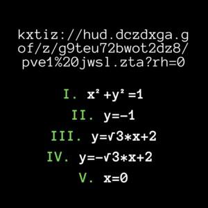{width="3.125in"
height="3.125in"}

> On solving the following equations, the following is formed (solved
> using\
> desmos), which is the symbol of Deathly Hallows in harry potter
> series, thus the key is 'deathly hallows' and on\
> using vigenere cipher, a link to a zip file on dropbox is obtained.

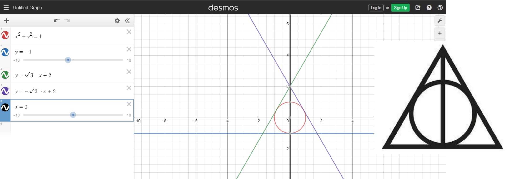{width="7.388888888888889in"
height="2.6125in"}

> The zip file had 2 files:\
> clue.txt\
> clue.zip
>
> The text contained the following:
>
> \--encrypted text begins\--
>
> a 4@C:? e g
>
> \--encrypted text ends---
>
> This is ROT-47 cipher, on decrypting we get the following text: 2
> corin 6 8 which takes us to 2 Corinthians 6:8 of Bible:
>
> \"We serve God whether people honor us or despise us, whether they
> slander us or praise us. We are honest, but they call us impostors.\"
>
> Here through the key-word 'impostors' gives us password for the zip
> file 'amongus'
>
> 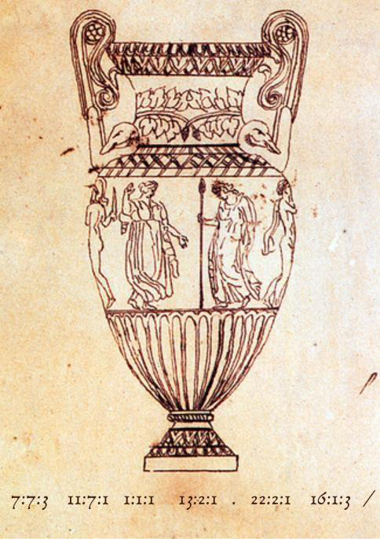{width="2.198611111111111in"
> height="3.1152766841644794in"}
>
> The zip had 2 files:
>
> atbackslash.mp3\
> ottendorf.png
>
> ottendorf is other word for book cipher, and the image gives us the
> poem 'Ode on a Grecian Urn' by John Keats, as it is the original
> drawing by him accompanying the poem. By using book cipher and the
> given numbers, we get 'cutt.ly/' and,

The audio has the following translation (after changing speed/reversing
the audio):

"I don\'t know why those hyper intelligent aliens went to Deep Thought,
they should have just bought a bubblegum, according to this guy. He
knows what he\'s talking about. I mean even Gina considers him as her
idol."

In Hitchhiker\'s guide to the galaxy, Deep Thought reveals that answer
to life, the universe and everything is 42, and in Superman (1978) Lex
Luthor says Some people can read War and Peace and come away thinking
it\'s a simple adventure story. Others can read the ingredients on a
chewing gum wrapper and unlock the secrets of the universe. Gina, from
Brooklyn 99, considers Lex Luthor as her entrepreneurial idol, thus the
link is cutt.ly/lexluthor

And we get the copper key!

After contacting admin, we get the link to Copper Key on Google Drive.

This contains 3 files:\
copperkey.jpg\
keep this safe for later.txt\
LVL2 invite.png

> 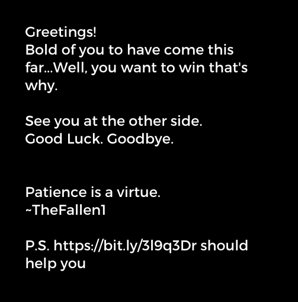{width="3.194443350831146in"
> height="3.234721128608924in"}

Contents of the text file:

\-\--text start\-\--\
the downy-bearded man says: \-\--text end\-\--

> 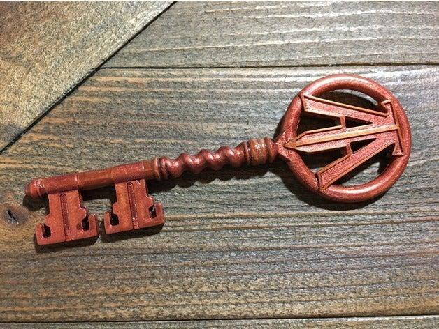{width="3.4055555555555554in"
> height="2.5569444444444445in"}

Downy-bearded man -\> Julius Caesar which refers to Caesar cipher. (The
name Julius may be derived from Greek ιουλος (ioulos) \"downy-bearded\")

Opening the bit.ly link, we are forwared to a riddle.

This site contained:

There once lived a brave king,\
Who was the most intelligent in the kingdom.

Everybody listened to his advice,\
For his words were full of wisdom.

He sought solace,\
Though he is the one you need to find.

Let Larry the blue Bird guide you,\
In this quest; unpleasant and unkind.

Larry the blue bird -\> Twitter

On searching twitter accounts of all 3 admins, one account was common
and followed by all 3.

+-----------------------------------+-----------------------------------+
| {width="4.647222222222222in" |                                   |
| height="2.6125in"}                |                                   |
+===================================+===================================+
+-----------------------------------+-----------------------------------+

and the text:\
\--encrypted text begins\--\
wahhh://oifxtiwf.rvu/nvpycijkwo.ta\
\--encrypted text ends\--

  -----------------------------------------------------------------------
  No, bro, it\'s not life. We just    .
  found                               
  ----------------------------------- -----------------------------------
                                      

  -----------------------------------------------------------------------

Using 'phosphine' as the key to the\
cipher, we get a link.

The link had the following text:

\--encrypted text begins\--

SOB IUDZ ORATHQ UAGU BES IAUC OBN PT UIA_KIBUMB_112 ESG ID ETQ\'S BV
DGXW OES YB DMVN, CTY OPT EBS EFZBXX HTUBAS BS YSOR DBMQU HCDA MK SOD
EQURAVDSY

\--encrypted text ends\--

key = Mornin\' to you too, Flo. Will The Wise person please tell someone
to keep it open?

The key is jimhopper, and technique is playfair cipher, which decrypted
to:

THE ONLY PERSON THAT CAN HELP YOU IS THE_DOCTOR_112 AND HE ISN\'T AN
EASY MAN TO FIND, BUT YOU CAN ALWAYS XSTART AT XTHE FRONT PAGE OF THE
INTERNETX

'the front page of the internet' refers to reddit, thus by searching for
u/THE_DOCTOR_112 we get a link which leads to a .zip file on Dropbox.

On the post on reddit, along with the text "Bro, it was back, and it was
everything I wanted it to be" it had the following image

> 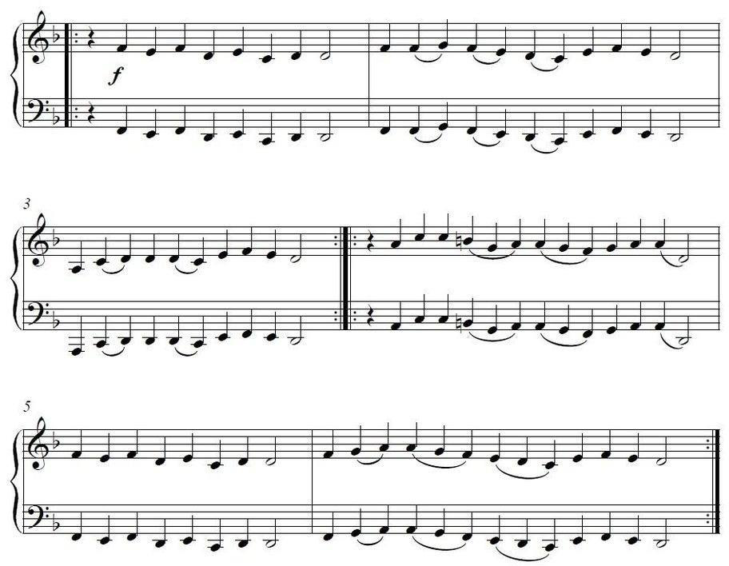{width="6.176388888888889in"
> height="4.794444444444444in"}

These music notes are from the medieval song 'dies irae' which was\
incorporated into the theme song of 'the shining'; the sequel of the
shining is doctor sleep, thus the password of zip file is doctorsleep.

Contents of zip file:

\--encrypted text begins\--

tslui://rhv.lsaondr.uey/g/meq5037vf7zrvyh/dzinbtsta.jln?gp=0

\--encrypted text ends\--

🗝 = He couldn\'t adapt that desert-spice. Sad. He would have included σ6
and https://bit.ly/3jYDGEU At least the new one is following his
footsteps.

The link led to a picture of a tea set. The tea set and σ6 refer to\
Pink Floyd, and the desert-spice refers to the Melange from 'Dune'. A
movie was in the works on Dune, by 'Alejando Jodorowsky', which was
later\
cancelled, and it was originally going to include original soundtrach
from Pink Floyd. The trailer for Dune (2021) has Eclipse by Pink Floyd
in the background. So, 'Alejando Jodorowsky' was the key for beaufort
cipherwhich led to a .rar file on dropbox.

This had legendary.zip file, which contained 2 files: hello.txt\
aclueisinside.zip (password protected)

The text file had the following contents:

Pronounce \[Jump, Standard Radio Message + Miss (Paul J. Crutzen)\]\
In Counter-Strike: Global Offensive, jump = space, Standard Radio
Message = X, hence SpaceX, the company of Elon Musk, and Paul J. Crutzen
popularized the Term, Anthroposcene. Miss Anhroposcene was the recent
album of the singer, Grimes. Grimes and Elon Musk\'s son, X Æ A-Xii,
which is prounounced, according to them, as X ash A twelve. So, password
was 'xashatwelve'.

Inside the zip file,\
Contents of ;-).txt

> 68 74 74 70 73 3a 2f 2f 69 74 74 79 2e 62 69 74 74 79 2e 73 69 74 65
> 2f 23 4c 56 4c 32 5f 43 6c 75 65 2f 3f 58 51 41 41 41 41 4c 73 41 41
> 41 41 41 41 41 41 41 41 41 57 34 5a 44 63 5a 48 45 61 39 62 4f 32 68
> 55 6a 64 45 70 65 33 73 69 74 70 42 73 49 37 59 42 59 67 72 35 5a 44
> 4f 44 7a 79 52 47 38 33 69 6a 56 75 6d 6e 42 53 63 61 75 4a 43 79 69
> 2b 52 70 71 2b 63 48 6c 35 30 71 65 6d 4d 6a 4a 65 68 6d 70 51 6e 62
> 49 79 46 77 62 4f 6a 37 68 53 30 44 48 48 7a 66 7a 61 72 4c 75 6b 6a
> 57 61 7a 42 68 4e 52 78 30 78 6c 4d 75 78 34 66 45 59 4f 69 37 66 39
> 35 53 52 32 45 68 33 5a 74 79 61 58 57 56 54 2f 5a 2b 59 48 58 57 4f
> 58 39 77 78 55 4f 45 33 6f 37 2b 2b 46 76 30 43 39 64 6d 62 6c 6a 67
> 54 6b 78 58 59 47 64 48 4b 32 57 73 63 30 76 34 57 6e 66 42 57 48 51
> 50 49 48 48 72 6f 69 4d 48 41 4a 6b 70 37 2f 64 77 68 41 41 41 3d 3d
>
> This is hexadecimal, which gives us a link to a site that contained
> the following:
>
> \--encrypted text begins\--
>
> twwwm://ett.inmaoxh.ybd/t/fskd4avbe317zfg/Yevhf.jpy?it=0
>
> \--encrypted text ends\--
>
> Key=Be it 9:41 or 10:09, it\'s always so expensive.
>
> The key refers to apple.
>
> On decrypting, we get a link to a zip file which had 2 file:
>
> hintz.mp3\
> LOL (zip archive)
>
> On listening to hintz (after changing speed/reversing the audio), "He
> says 43 is the best thing he's done in his career, I agree. But I\'m
> also thankful to him for inspiring that American Masterpiece\..."
>
> Thus,we get to creator of the Office UK, ricky gervais, hence the
> password of the zip archive.
>
> In the archive, we have an image and another zip file,

{width="6.493055555555555in"
height="1.7999989063867017in"}

> In this image, MORN stock rates of the company, Morningstar, and name
> of the image: "venom of god", along with Venus 'morning star' leads us
> to Lucifer, which is the password of the zip file.
>
> New zip archive had 2 files:\
> veryclose.txt\
> clue.jpg

+-----------------------------------+-----------------------------------+
| {width="1.4583333333333333in" | > the key\                        |
| height="2.183333333333333in"}     | > 'heyvsaucemichaelhere', and the |
|                                   | > decrypted link to the Jade key. |
+===================================+===================================+
+-----------------------------------+-----------------------------------+

After contacting admin, we get the link to Copper Key on Google Drive.

This contains 3 files:\
keep this safe for later2.txt\
jadekey.jpg\
LVL 3 Invitation.png

The text file had the following content:

eqqmp://yfq.iv -\> https://bit.ly (in Caesar cipher)Which related to the
first 'keep it safe for later' file.

> 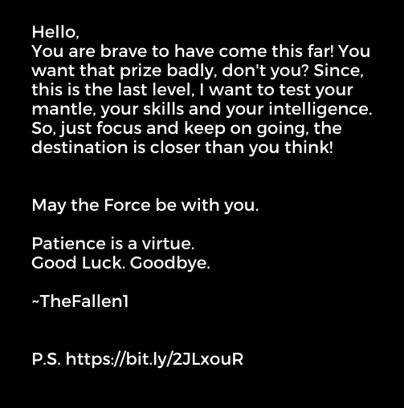{width="3.2472222222222222in"
> height="3.286111111111111in"}
>
> 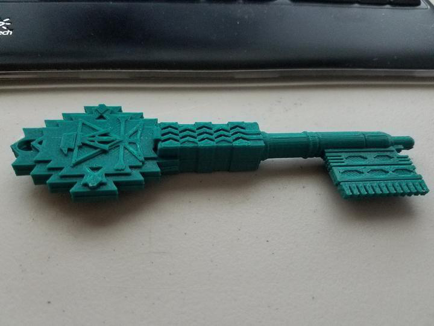{width="3.375in"
> height="2.5319444444444446in"}

On opening the bit.ly, we get the link to dropbox.

It had 2 files:\
insideisaclue.zip\
keepgoingon.txt

Contents of text file:

At least the Allies\' 2 inch medium trench mortar provided a nice
comeback to this MIT genius after he scored the number of that Harvard
Girl

This gives us the movie, 'Good Will Hunting', and the famous line 'how
you like them apples', thus the password = howyoulikethemapples

On opening the text file inside, we get:

> 00101101 00101110 00101110 00101110 00101110 00100000 00101101
> 00101101 00101101 00101110 00101110 00100000 00101111 00100000
> 00101101 00101101 00101110 00101110 00101110 00100000 00101110
> 00101110 00101110 00101110 00101101 00100000 00101111 00100000
> 00101101 00101101 00101110 00101110 00101110 00100000 00101110
> 00101110 00101110 00101110 00101101 00100000 00101111 00100000
> 00101101 00101101 00101110 00101110 00101110 00100000 00101101
> 00101101 00101101 00101101 00101101 00100000 00101111 00100000
> 00101101 00101101 00101110 00101110 00101110 00100000 00101110
> 00101110 00101110 00101101 00101101 00100000 00101111 00100000
> 00101110 00101110 00101110 00101101 00101101 00100000 00101110
> 00101101 00100000 00101111 00100000 00101110 00101110 00101101
> 00101101 00101101 00100000 00101110 00101110 00101101 00101110
> 00100000 00101111 00100000 00101110 00101110 00101101 00101101
> 00101101 00100000 00101110 00101110 00101101 00101110 00100000
> 00101111 00100000 00101101 00101110 00101110 00101110 00101110
> 00100000 00101101 00101101 00101101 00101110 00101110 00100000
> 00101111 00100000 00101101 00101110 00101110 00101110 00101110
> 00100000 00101110 00101101 00101101 00101101 00101101 00100000
> 00101111 00100000 00101101 00101101 00101110 00101110 00101110
> 00100000 00101110 00101110 00101110 00101101 00101101 00100000
> 00101111 00100000 00101101 00101101 00101110 00101110 00101110
> 00100000 00101110 00101110 00101110 00101110 00101101 00100000
> 00101111 00100000 00101101 00101110 00101110 00101110 00101110
> 00100000 00101110 00101110 00101110 00101110 00101110 00100000
> 00101111 00100000 00101101 00101110 00101110 00101110 00101110
> 00100000 00101110 00101110 00101101 00101101 00101101 00100000
> 00101111 00100000 00101101 00101110 00101110 00101110 00101110
> 00100000 00101101 00101101 00101101 00101101 00101110 00100000
> 00101111 00100000 00101101 00101110 00101110 00101110 00101110
> 00100000 00101110 00100000 00101111 00100000 00101110 00101110
> 00101101 00101101 00101101 00100000 00101110 00100000 00101111
> 00100000 00101101 00101110 00101110 00101110 00101110 00100000
> 00101110 00101110 00101110 00101101 00101101 00100000 00101111
> 00100000 00101101 00101110 00101110 00101110 00101110 00100000
> 00101110 00101110 00101101 00101110 00100000 00101111 00100000
> 00101101 00101110 00101110 00101110 00101110 00100000 00101101
> 00101110 00101110 00100000 00101111 00100000 00101110 00101110
> 00101101 00101101 00101101 00100000 00101110 00101110 00101101
> 00101110 00100000 00101111 00100000 00101101 00101110 00101110
> 00101110 00101110 00100000 00101110 00101110 00101101 00101110
> 00100000 00101111 00100000 00101101 00101110 00101110 00101110
> 00101110 00100000 00101110 00101110 00101110 00101110 00101101
> 00100000 00101111 00100000 00101101 00101101 00101110 00101110
> 00101110 00100000 00101110 00101110 00101110 00101110 00101110
> 00100000 00101111 00100000 00101101 00101110 00101110 00101110
> 00101110 00100000 00101110 00100000 00101111 00100000 00101101
> 00101110 00101110 00101110 00101110 00100000 00101110 00101110
> 00101101 00101110 00100000 00101111 00100000 00101101 00101110
> 00101110 00101110 00101110 00100000 00101101 00101110 00101110
> 00101110 00101110 00100000 00101111 00100000 00101101 00101110
> 00101110 00101110 00101110 00100000 00101110 00101110 00101110
> 00101110 00101110 00100000 00101111 00100000 00101101 00101110
> 00101110 00101110 00101110 00100000 00101110 00101110 00101101
> 00101101 00101101 00100000 00101111 00100000 00101101
>
> 00101110 00101110 00101110 00101110 00100000 00101110 00101110
> 00101110 00101110 00101110 00100000 00101111 00100000 00101101
> 00101110 00101110 00101110 00101110 00100000 00101101 00101110
> 00101101 00101110 00100000 00101111 00100000 00101110 00101110
> 00101101 00101101 00101101 00100000 00101110 00100000 00101111
> 00100000 00101101 00101101 00101110 00101110 00101110 00100000
> 00101101 00101101 00101101 00101101 00101101 00100000 00101111
> 00100000 00101101 00101101 00101110 00101110 00101110 00100000
> 00101110 00101110 00101101 00101101 00101101 00100000 00101111
> 00100000 00101101 00101110 00101110 00101110 00101110 00100000
> 00101110 00101110 00101101 00101110 00100000 00101111 00100000
> 00101101 00101101 00101110 00101110 00101110 00100000 00101101
> 00101101 00101101 00101101 00101101 00100000 00101111 00100000
> 00101101 00101110 00101110 00101110 00101110 00100000 00101110
> 00101110 00101110 00101110 00101110 00100000 00101111 00100000
> 00101101 00101101 00101110 00101110 00101110 00100000 00101110
> 00101110 00101101 00101101 00101101 00100000 00101111 00100000
> 00101101 00101101 00101110 00101110 00101110 00100000 00101110
> 00101110 00101110 00101110 00101101 00100000 00101111 00100000
> 00101101 00101110 00101110 00101110 00101110 00100000 00101101
> 00101101 00101101 00101101 00101110 00100000 00101111 00100000
> 00101101 00101110 00101110 00101110 00101110 00100000 00101110
> 00101110 00101110 00101110 00101110 00100000 00101111 00100000
> 00101101 00101101 00101110 00101110 00101110 00100000 00101110
> 00101110 00101110 00101101 00101101 00001101 00001010 00001101
> 00001010

Which translates to:

-\.... \-\--.. / \--\... \....- / \--\... \....- / \--\... \-\-\-\-- /
\--\... \...\-- / \...\--

.- / ..\-\-- ..-. / ..\-\-- ..-. / -\.... \-\--.. / -\.... .\-\-\-- /
\--\... \...\-- / \--

\... \....- / -\.... \..... / -\.... ..\-\-- / -\.... \-\-\--. / -\....
. / ..\-\-- . / -

\.... \...\-- / -\.... ..-. / -\.... -.. / ..\-\-- ..-. / -\.... ..-. /
-\.... \....- /

\--\... \..... / -\.... . / -\.... ..-. / -\.... -\.... / -\.... \.....
/ -\.... ..\-\--

/ -\.... \..... / -\.... -.-. / ..\-\-- . / \--\... \-\-\-\-- / \--\...
..\-\-- / -\.... ..-.

/ \--\... \-\-\-\-- / -\.... \..... / \--\... ..\-\-- / \--\... \....- /
-\.... \-\-\--. / -\....

\..... / \--\... \...\--

Which further translates to:

> 68 74 74 70 73 3A 2F 2F 68 61 73 74 65 62 69 6E 2E 63 6F 6D 2F 6F 64
> 75 6E 6F 66 65 62 65 6C 2E 70 72 6F 70 65 72 74 69 65 73

Which at last gives the link to a site.

> The text on the site was as follows:
>
> There once lived a pirate,\
> Cunning and wicked,\
> He went by the name of Captain Cyptix,\
> And sailed the Caribbean\'s waves and journeyed through the thicket.
>
> He\'s largely forgotten now,\
> Only few remember his face.
>
> Maybe one of Mark Elliot Z\'s children can help you, Only they possess
> that knowledge and grace.
>
> Mark Elliot Z is Mark Elliot Zuckerberg, and his children are
> companies acquired by him, so it leads to a (clue) account on
> Instagram, which had:

{width="3.848610017497813in"
height="3.077777777777778in"}

> \--encrypted text begins\--
>
> xuvwi://irs.ijqynxd.czc/t/nf73938am9
> kkzpz/Lnquhhj%20Rjs%20PsrWOU%20BWY%2 0ouyx fth.bwy?la=0
>
> \--encrypted text ends\--
>
> Key = Hope she is not stuck in a crashing airplane this time with
> everyone sleeping. Sisters! You know!?
>
> By hit and try, the key was 'enola' and the cipher was beaufort
> cipher. On opening
>
> the link, we get a pdf file and an audio file (after changing\
> speed/reversing the audio):\
> "Be cautious of this man, he is the king of kings and The World\'s
> Smartest Man and he wants his family to leave town, but they won\'t.
> So he took off with \$11 Million."
>
> On relating to audio file, we get the password of pdf 'ozymandias'
>
> Contents of pdf file:
>
> \--encrypted text begins\--\
> aaxqg://aggavpza.uht/e9d40969\
> \--encrypted text ends\--\
> Key = \"You want to get back into the Team? Well, do as we say.
> Anyway, do you want a drink? It\'s ingredients are given below\...
>
> Key was 'the boys', leading to\
> a link.
>
> On opening it, we get:
>
> \--encrypted text begins\--
>
> eltzv://cwr.flwpsxh.kab/g/qi4di2iqitd46na/ncovuqgcira.az4?kn=0
>
> \--encrypted text ends\--
>
> key= Don\'t ask any stable person. They don\'t know what they are
> saying. Anyway I don\'t have any sugar for the tea; I recently
> misplaced my Sugar Bowl. Well, hello my name is
> L\...\...\...\...\.....
>
> By this, we get 'lemony snicket', which further gives a link for the
> video of 'Never Gonna Give You Up' by Rick Astley, (but with the song,
> album, artist and record label name changed, and ottendorf codes
> scattered in the whole video)
>
> On seeing the video, we get book code along with the name 'The New
> Colossus, Emma Cazarus'
>
> On decrypting, we get the link to a rar file, in which,
>
> On opening the txt file, we get:
>
> 9 19 8 15 21 12 4 14 20 2 5 16 9 22 15 20 9 14 7 1 19 15 6 1 9 19 8 15
> 21 12 4 2 5 16 9 22 15 20 9 14 7 1 14 5 14 20 9 18 5 3 15 13 16 1 14
> 25 1 12 20 8 15 21 7 8 9 20 9 19 19 20 9 12 12 1 19 20 1 18 20 21 16
>
> Ishouldntbepivotingasofaishouldbepivotinganentirecompanyalthoughitisstillasta
> rtup\
> -\>\
> I shouldnt be pivoting a sofa, I should be pivoting an entire company,
> although it is still a startup.
>
> This is related to the series 'FRIENDS' and 'silicon valley', and the
> key was character 'jareddun'
>
> On opening the zip file, we get an audio file, which is the title
> track of bojack horseman, and the pass for the last zip was
> 'secretariat' from "you are \_\_\_\_\_\_\_\_."
>
> And, we get the crystal key!
>
> After messaging the admin, we get:

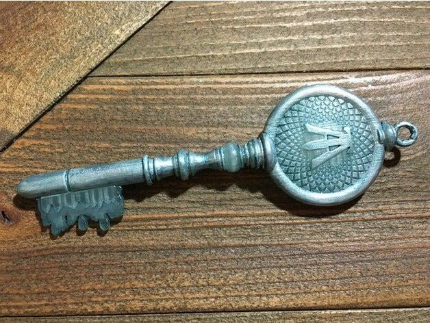{width="2.5444444444444443in"
height="1.9138877952755906in"}

> and a text file with the the last part of the link (in Caesar cipher
> as well)Which related to the first two 'keep it safe for later' files,
> thus we got our final link, at the end of the quest, which leads to
> the gate of the Easter Egg. After\
> completing the form, we are transported to the Easter Egg, and
>
> The hunt
>
> Is
>
> Finally
>
> Completed.
